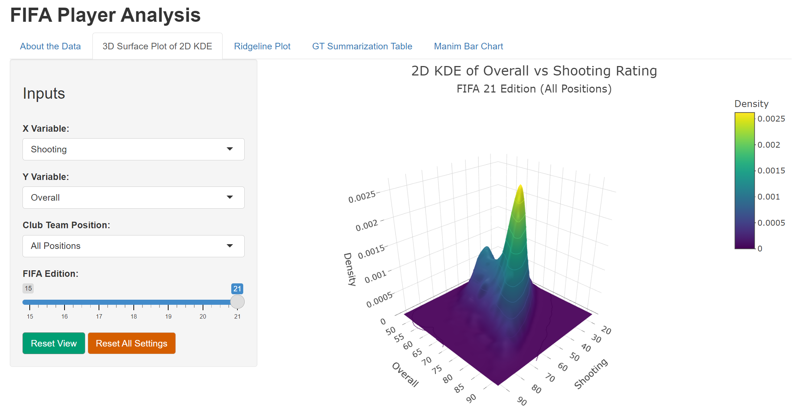
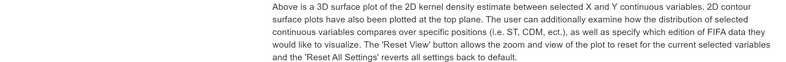
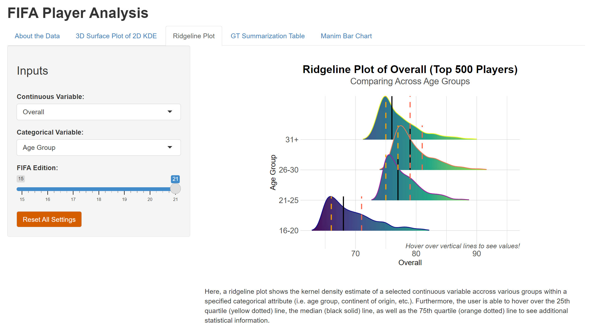
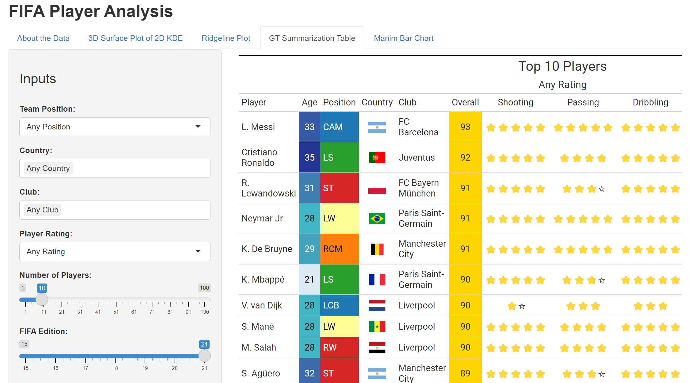
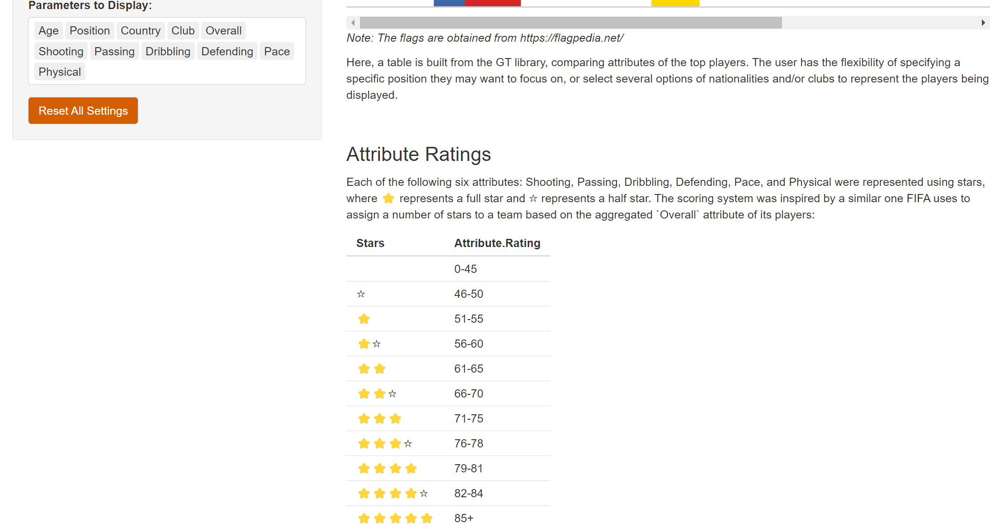
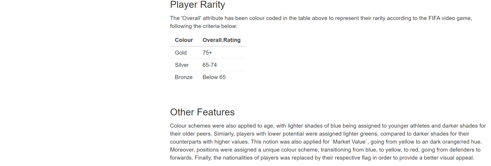
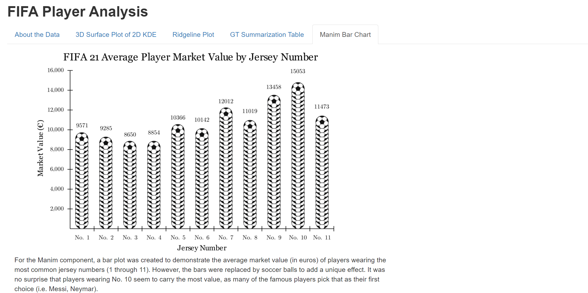

# FIFA Career Mode Player Analysis App (FIFA 15–21)

_Exploring Player Evolution and Positional Trends Across Seven Years of FIFA Career Mode_

An interactive R Shiny dashboard that visualizes and analyzes 120,000+ player records across FIFA editions 2015 to 2021. This project blends real-world sports data with high-level data engineering, UI/UX, and dynamic visual storytelling to deliver a professional-grade analytics experience.

---

## Table of Contents

- [Project Overview](#project-overview)  
- [Features](#features)  
- [Tech Stack](#tech-stack)  
- [Dataset Description](#dataset-description)
- [How the App Works](#how-the-app-works)  
- [Running the App](#️running-the-app)  
- [Author](#️author)  
- [License](#license)

---

## Project Overview

This dashboard enables data scientists, analysts, and football enthusiasts to interactively explore FIFA player data across seven game editions. By combining powerful visualizations, smart filtering, and clean preprocessing pipelines, users can compare player metrics by position, age, region, club, and more — all through an intuitive interface.

---

## Features

### 1. 3D Kernel Density Estimation (KDE)
- Interactive 3D surface + contour plots of variables (i.e. Overall vs Shooting)  
- Filters by FIFA edition and player position



### 2. Ridgeline Density Plot
- Compare metrics (e.g., Pace, Dribbling) across:
  - Age groups
  - Position types
  - Player origin or league continent
- Includes hoverable tooltips for Q1, Median, Q3


### 3. Stylized GT Summary Table
- View top N players by position, country, rating, or club  
- Flag icons, star-based attribute ratings, player rarity coloring (Gold/Silver/Bronze)  
- Custom color gradients for age, potential, market value




### 4. Animated Bar Chart (Manim)
- A custom bar chart using soccer balls to compare average player market values by jersey number


---

## Tech Stack

**Languages & Frameworks**  
- R  
- Shiny (for reactive UI/Server architecture)

**Key Packages**  
| Package         | Purpose                                  |
|------------------|-------------------------------------------|
| `shiny`          | Web application framework                |
| `ggplot2`        | Static plots (e.g., ridgeline)           |
| `plotly`         | 3D and interactive surface plots         |
| `ggridges`       | Ridgeline visualizations                 |
| `gt`             | Styled summary tables                    |
| `ggiraph`        | Tooltip-enhanced plots                   |
| `dplyr`, `tidyr` | Data wrangling                          |
| `readxl`         | Excel import (multi-sheet)               |
| `countrycode`    | Convert nationality/league to continent  |

---

## Dataset Description

Original dataset from Kaggle:
- [FIFA 21 Complete Player Dataset](https://www.kaggle.com/datasets/stefanoleone992/fifa-21-complete-player-dataset) by Stefano Leone 
- Contains 7 sheets (FIFA15 → FIFA21)  
- 120K+ total records × 30+ variables

### Sample Columns

| Column           | Description                              |
|------------------|-------------------------------------------|
| `overall`        | Player’s overall FIFA rating              |
| `potential`      | Projected career potential                |
| `value_eur`      | Market value in Euros                     |
| `team_position`  | Club position (e.g., ST, CAM, CB)         |
| `nationality`    | Player’s country                          |
| `club_name`      | FIFA club the player belongs to           |
| `pace`, `passing`, `shooting` | Skill metrics                  |
| `fifa_edition`   | Edition year (e.g., 21 = FIFA 21)         |

---

## How the App Works

### 1. Data Preparation
- Loads and merges all 7 FIFA Excel sheets
- Extracts key variables and cleans missing/inconsistent values
- Categorizes players by position, age group, region
- Adds ISO country codes and flag URLs

### 2. User Interface (UI)
- Four main tabs: KDE Plot, Ridgeline Plot, Summary Table, Manim Chart
- Filters: Edition, position, country, club, rating, parameters to display

### 3. Server Logic
- Reactive filtering and plot generation
- KDE via `MASS::kde2d`
- Ridgelines with tooltip segments (Q1, Median, Q3)
- GT table with color gradients, icons, and custom themes

---

## Running the App

### Prerequisites

Ensure R and RStudio are installed.

### Install Required Packages

```r
install.packages(c(
  "shiny", "plotly", "ggplot2", "ggridges", "gt", "ggiraph",
  "dplyr", "readxl", "countrycode", "writexl", "stringr", "scales", 
  "htmltools", "htmlwidgets", "MASS"
))
```

### Run the App
```r
shiny::runApp()
```

---

## Author
**Matthew Badal-Badalian**  
*MDSAI Graduate, University of Waterloo*  

### Links
- [LinkedIn](https://www.linkedin.com/in/badal/)    
- [GitHub](https://github.com/mbadalbadalian)

---

## License
MIT License © 2025 Matthew Badal-Badalian
